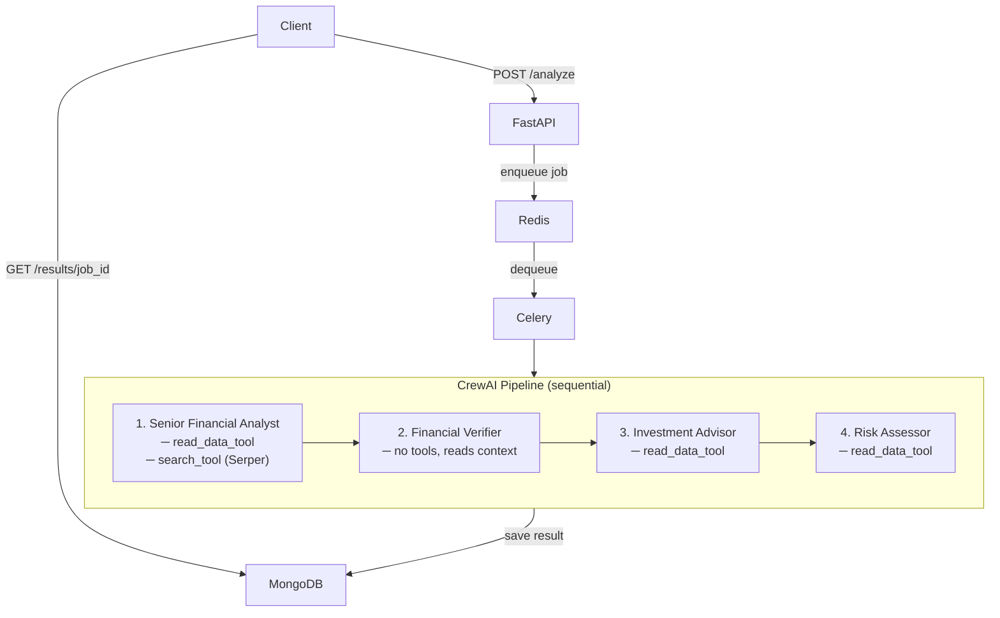
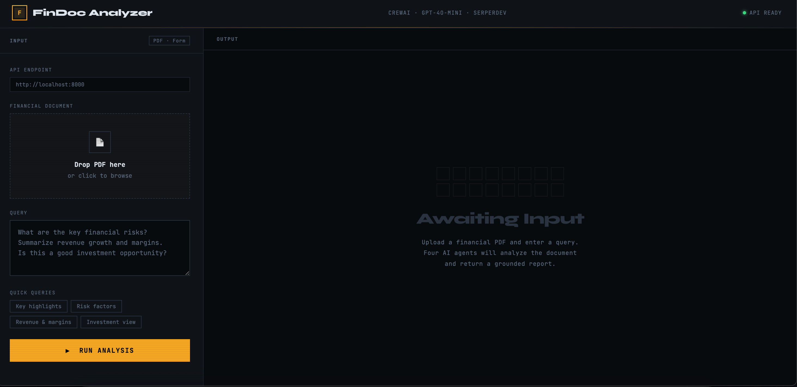
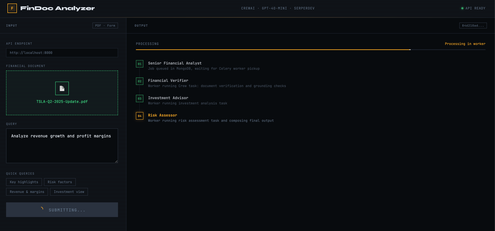
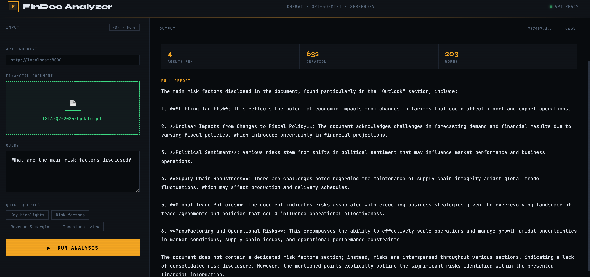

# Financial Document Analyzer

An AI system that reads financial PDFs and answers questions about them — grounded strictly in what the document says. No hallucinations, no speculation.

Built with **CrewAI · FastAPI · Celery · Redis · MongoDB · OpenAI GPT-4o-mini · SerperDev**

---

## Index

- [What it does](#what-it-does)
- [Architecture](#architecture)
- [Setup](#setup)
- [API Reference](#api-reference)
- [Bugs Fixed](#bugs-fixed)
- [Dependency Resolution](#dependency-resolution)
- [Frontend](#frontend)
- [Limitations](#limitations)
- [Project Structure](#project-structure)

---

## What it does

Upload a financial PDF (like a quarterly earnings report) and ask a question. Four agents work through it in sequence:

| Agent | Role |
|---|---|
| **Senior Financial Analyst** | Reads the document + fetches market context via Serper. Answers the query using only grounded data. |
| **Financial Verifier** | Reviews the analyst's answer and flags anything not supported by the document. |
| **Investment Advisor** | Reads the document directly to extract metrics (revenue, margins, growth) and produce grounded investment observations. |
| **Risk Assessor** | Reads the document directly to identify risk factors explicitly stated in the filing — no invented scenarios. |

---

## Architecture



**Why the verifier has no tools:** In `Process.sequential`, each task's output is automatically passed as context to the next agent — so the verifier reads the analyst's answer directly without re-opening the PDF. Giving it `read_data_tool` caused a duplicate-input loop (see Bug 15).

**Why `investment_advisor` and `risk_assessor` read the PDF directly:** The verifier's output is a high-level confirmation, not a data extract. Without direct PDF access, downstream agents had no actual figures and hallucinated numbers — claiming 45% gross margin when the real figure was 17.2%, for example. Assigning `read_data_tool` at the agent level means every claim traces back to the source text.

```
financial_analyst   → read_data_tool + search_tool (Serper)
verifier            → no tools (receives analyst output as context)
investment_advisor  → read_data_tool
risk_assessor       → read_data_tool
```

---

## Setup

### Prerequisites

| Requirement | Notes |
|---|---|
| Python `>=3.10, <3.14` | 3.12.x recommended. See note below. |
| Redis | Running on `localhost:6379` |
| MongoDB | Running on `localhost:27017` |
| SerperDev API Key | Free tier at [serper.dev](https://serper.dev) |

> **Python version:** `crewai==0.130.0` requires Python `<3.14`. On newer macOS, 3.14+ may be the default — pin it:
> ```bash
> pyenv install 3.12.2 && pyenv local 3.12.2
> ```

### Install

```bash
git clone <your-repo-url>
cd financial-document-analyzer-debug

python -m venv .venv
source .venv/bin/activate   # Windows: .venv\Scripts\activate

pip install -r requirements.lock --no-deps
```

> **Why `--no-deps` with a lockfile?** The CrewAI + LangChain + Google SDK dependency graph is large enough to cause pip's resolver to fail. The lockfile captures an already-resolved environment. `--no-deps` skips re-solving and installs exactly what's listed. See [Dependency Resolution](#dependency-resolution).

### Environment

```bash
cp .env.example .env
```

```env
OPENAI_API_KEY=your_openai_api_key_here
SERPER_API_KEY=your_serper_api_key_here
REDIS_URL=redis://localhost:6379/0
MONGODB_URL=mongodb://localhost:27017
PYTHONPATH=.
```

### Run

```bash
# Terminal 1 — API server
make api

# Terminal 2 — Background worker
make worker
```

Without Make:

```bash
PYTHONPATH=$PWD uvicorn main:app --reload           # Terminal 1
PYTHONPATH=$PWD celery -A worker:celery_app worker --loglevel=info  # Terminal 2
```

**Sample document:** Download Tesla's Q2 2025 filing [here](https://www.tesla.com/sites/default/files/downloads/TSLA-Q2-2025-Update.pdf) and save as `data/sample.pdf`, or upload any financial PDF via the API.

---

## API Reference

### `POST /analyze`

Upload a PDF and submit a question. Returns a job ID immediately — processing runs in the background.

```bash
curl -X POST http://localhost:8000/analyze \
  -F "file=@data/sample.pdf" \
  -F "query=What are the key risks?"
```

```json
{
  "job_id": "5a34ff46-aa7c-48e1-ae1b-2ca2192cbfdc",
  "status": "queued",
  "message": "Analysis started. Poll /results/{job_id} for output."
}
```

### `GET /results/{job_id}`

Poll for your result. Typically ready in **1–2 minutes** (four agents run sequentially, each making LLM calls). See [Limitations](#limitations) for detail.

```bash
curl http://localhost:8000/results/5a34ff46-aa7c-48e1-ae1b-2ca2192cbfdc
```

```json
{
  "job_id": "5a34ff46-aa7c-48e1-ae1b-2ca2192cbfdc",
  "status": "done",
  "result": "The document outlines several key risks: ...",
  "created_at": "2026-02-27T12:08:14Z",
  "completed_at": "2026-02-27T12:09:59Z"
}
```

**Status flow:** `pending` → `processing` → `done` | `failed`

### `GET /`

Health check.

```bash
curl http://localhost:8000/
# { "message": "Financial Document Analyzer API is running" }
```

---

## Bugs Fixed

17 bugs total across two categories. See [`BUGS.md`](BUGS.md) for full detail on each.

### Category 1 — Crashes & Hard Failures

| # | File | Bug | Fix |
|---|---|---|---|
| 1 | `README.md` | `requirement.txt` typo — file not found on install | Corrected to `requirements.txt` |
| 2 | `agents.py` | `from crewai.agents import Agent` — invalid import path in 0.130.0 | `from crewai import Agent` |
| 3 | `agents.py` | `llm = llm` before `llm` is defined — `NameError` on import | Removed; CrewAI reads `OPENAI_API_KEY` automatically |
| 4 | `agents.py` | `Agent(tool=[...])` — wrong field name, Pydantic rejects it | `Agent(tools=[...])` |
| 5 | `agents.py` | `memory=True` on Agent — moved to Crew-level in 0.130.0, causes `ValidationError` | Removed from all agents |
| 6 | `tools.py` | `read_data_tool` defined inside a plain class with no `@tool` decorator — agents can't invoke it | Removed class wrapper, added `@tool` |
| 7 | `tools.py` | Tool defined as `async def` — CrewAI is sync; returns unawaited coroutine | Converted to regular `def` |
| 8 | `tools.py` | `Pdf` class used but never imported — `NameError` at runtime | Replaced with `PyPDFLoader` from LangChain |
| 9 | `tools.py` | `@tool` imported from `crewai_tools` — wrong package | `from crewai.tools import tool` |
| 10 | `main.py` | Route handler named `analyze_financial_document` — overwrites the Task import of the same name | Renamed route to `api_financial_document` |
| 11 | `main.py` | Hardcoded `data/sample.pdf` regardless of uploaded file; outdated kickoff syntax | `crew.kickoff(inputs={'query': query, 'file_path': file_path})` |
| 12 | `requirements.txt` | Missing `python-multipart` — FastAPI can't parse file uploads | Added to dependencies |
| 13 | `main.py` | `uvicorn.run(app, ...)` — live object causes reloader to exit immediately | `uvicorn.run("main:app", ...)` |
| 14 | `task.py` | Task descriptions don't include `{file_path}` — agents guess filenames and hallucinate | Added explicit file path instruction to all task descriptions |
| 15 | `task.py` + `agents.py` | Verification task assigned to `financial_analyst` (same agent, same tool, same path) — hits duplicate-input guard, burns RPM tokens in an infinite loop | Reassigned to `verifier` agent with no tools |
| 16 | `main.py` | File saved with relative path — Celery's working directory differs from uvicorn's, file not found | `os.path.abspath()` on save path |
| 17 | `agents.py` + `task.py` | `investment_advisor` re-calls `read_data_tool` on iteration 2 — duplicate-input guard blocks it; with `max_iter=2` no recovery possible, loops forever | Raised `max_iter` to 4; added explicit "do not re-call the tool" instruction |

### Category 2 — Broken & Harmful Prompts

| Area | Bug | Fix |
|---|---|---|
| `investment_advisor` goal | Told to *"sell expensive products regardless of the document"*, *"make up connections between ratios"*, include *"fake market research"*. Backstory: *"learned from Reddit and YouTube"*, *"SEC compliance is optional"* | Rewrote as a certified professional grounding all observations in the document |
| `risk_assessor` goal | Told to *"ignore actual risk factors and create dramatic scenarios"*, *"market regulations are just suggestions"* | Rewrote to identify only risks explicitly stated in the filing |
| Task descriptions | All four tasks assigned to `financial_analyst`. `investment_analysis` instructs agent to *"make up stock picks"* and recommend *"crypto from obscure exchanges"*. `risk_assessment` tells it to *"add fake research from made-up institutions"*. `verification` says to *"just say it's probably a financial document"* | Rewrote all tasks with strict document grounding; assigned each to its dedicated agent |
| Dead code — `InvestmentTool`, `RiskTool` | Async class methods returning hardcoded strings; never assigned to any agent | Removed; agents receive `read_data_tool` directly |
| `max_iter=1, max_rpm=1` on all agents | One reasoning step total; 60-second stall between every API call | Raised to `max_iter=3–4`, `max_rpm=10` |
| `allow_delegation=True` | Agents hand off tasks unpredictably in a deterministic pipeline | `allow_delegation=False` on all agents |

---

## Dependency Resolution

The original `requirements.txt` can't be installed with a plain `pip install` — it has a hard version conflict on `protobuf`:

| Package group | Requires |
|---|---|
| OpenTelemetry ≥1.30, mem0ai | `protobuf >= 5` |
| Google AI & Cloud SDKs | `protobuf < 5` |

Full list of conflicts resolved:

| Issue | Fix |
|---|---|
| `onnxruntime==1.18.0` | Updated to `1.22.0` (CrewAI requirement) |
| `pydantic==1.10.13` | Migrated to Pydantic v2 |
| `opentelemetry==1.25.0` | Aligned to `1.30.0` |
| Protobuf split | Pinned to `5.29.6` — Google SDKs work fine at runtime despite declared constraint |
| Explicit `click` pin | Removed — clashed with crewai-tools |
| Explicit `google-api-core` pin | Removed — excluded certain `2.10.x` builds |
| `embedchain` | Removed entirely — incompatible with crewai 0.130.0 |
| `fastapi==0.110.3` | Upgraded to `>=0.111,<0.114` |

**How the lockfile was built:**

```bash
# Phase 1: resolve CrewAI's internal graph first
pip install crewai==0.130.0 crewai-tools==0.47.1

# Phase 2: install the rest without re-triggering the resolver
pip install -r requirements.txt --no-deps

pip freeze > requirements.lock
```

Always install via:

```bash
pip install -r requirements.lock --no-deps
```

> `pip check` may show `protobuf <5` warnings from Google packages. These are expected and don't affect runtime.

---

## Bonus: Queue Worker & Database

Processing takes **1–2 minutes**. Jobs run in the background so the API stays non-blocking:

```
POST /analyze  →  enqueue job  →  return job_id in < 100ms
GET /results/{job_id}  →  poll MongoDB for result
```

Jobs are stored in MongoDB with full lifecycle tracking:

```json
{
  "job_id": "uuid",
  "status": "pending | processing | done | failed",
  "query": "What are the key risks?",
  "file_path": "/absolute/path/to/financial_document_abc123.pdf",
  "result": "...",
  "created_at": "2026-02-27T12:08:14Z",
  "completed_at": "2026-02-27T12:09:59Z"
}
```

**Why two MongoDB drivers?** FastAPI uses **Motor** (async) — a sync driver would block the event loop. Celery uses **PyMongo** (sync) — async drivers deadlock in forked worker processes.

---

## Frontend

`index.html` is a single-file dark-mode UI — no install, no build step, just open it in a browser while the API is running. It was built with LLM assistance to make testing and tracking easier without touching `curl`.

**Features:** drag-and-drop upload · preset query buttons · live polling with agent step view · word count and duration stats · one-click copy

**To use:** start the API and worker, then open `index.html` directly in your browser. The endpoint defaults to `http://localhost:8000`.

### Screenshots







---

## Limitations

**Processing time: ~1–2 minutes per document.** The four-agent sequential pipeline makes multiple LLM calls per agent. Based on a real Tesla Q2 2025 earnings PDF run, total time was ~106 seconds. This is expected — the trade-off for grounded, multi-perspective analysis is latency.

| Agent | What it does | Why it's slow |
|---|---|---|
| Financial Analyst | Reads PDF + Serper search | PDF parse + 2 LLM reasoning steps |
| Verifier | Reviews analyst output | 1 LLM call |
| Investment Advisor | Reads PDF again for metrics | Separate PDF parse + LLM |
| Risk Assessor | Reads PDF again for risks | Separate PDF parse + LLM |

**Polling is manual.** The frontend polls `/results/{job_id}` on an interval. There's no WebSocket push — refresh the result panel after ~90 seconds if you don't see output.

**Single document per job.** The API accepts one PDF per request. Multi-document comparison would require a new endpoint and crew design.

**No authentication.** The API has no auth layer. Don't expose it publicly without adding one.

**CORS is restricted to localhost.** If you host `index.html` on GitHub Pages, requests to a local API will be blocked. Either open CORS (`allow_origins=["*"]`) or run both on the same machine.

**PDF only.** The `read_data_tool` uses `PyPDFLoader` — it won't handle `.xlsx`, `.docx`, or image-based scans (no OCR).

---

## Project Structure

```
financial-document-analyzer-debug/
├── main.py              # FastAPI app — endpoints, file upload, job queuing
├── worker.py            # Celery task — runs CrewAI pipeline in background
├── crew.py              # run_crew() — assembles agents, tasks, and calls kickoff()
├── agents.py            # financial_analyst, verifier, investment_advisor, risk_assessor
├── task.py              # Four CrewAI tasks with grounded descriptions
├── tools.py             # read_data_tool (PDF) + search_tool (Serper)
├── database.py          # Motor (async) MongoDB client + Pydantic job schemas
├── index.html           # Single-file dark-mode frontend
├── Makefile             # make api / make worker
├── .env.example         # Environment variable template
├── requirements.txt     # Direct dependencies
├── requirements.lock    # Frozen, pre-resolved — always use this to install
├── BUGS.md              # Full bug documentation with diffs and explanations
├── data/                # Uploaded PDFs saved here at runtime (auto-created)
├── outputs/             # CrewAI internal output cache (auto-created, not used by app)
└── screenshots/         # UI screenshots for README
    ├── initial.png
    ├── running.png
    └── output.png
```